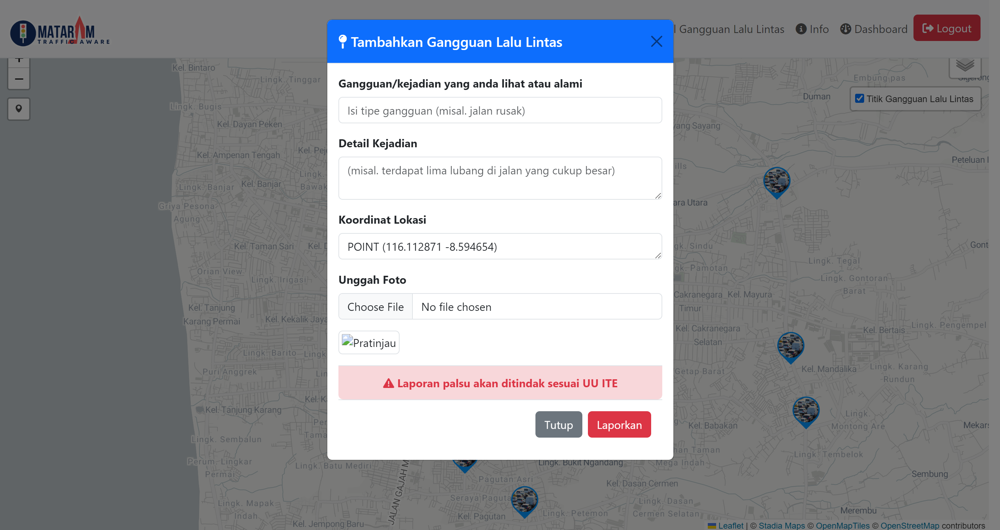

# Mataram Traffic Aware
## Deskripsi Project
**Mataram Traffic Aware** adalah aplikasi WebGIS yang dirancang untuk memantau dan melaporkan gangguan lalu lintas di Kota Mataram. Aplikasi ini memberikan informasi  mengenai kondisi lalu lintas, membantu pengguna menghindari rute yang bermasalah, dan mendukung pihak berwenang dalam mengelola lalu lintas dengan lebih efisien.

## Komponen Pembangun

### Leaflet JS
Menampilkan basemap peta dasar yang interaktif

### Database PostgreSQL
Sistem manajemen basis data relasional untuk menyimpan dan mengelola data lalu lintas. Dengan ekstensi PostGIS, PostgreSQL dapat menangani data geospasial dengan efisien.

### Geoserver dan QGIS
Server open-source yang memungkinkan berbagi, memproses, dan mengedit data geospasial. Dalam project ini, Geoserver digunakan untuk menyajikan data spasial dari QGIS dengan PostGIS ke Leaflet JS.

### Bootstrap
Merancang layout aplikasi yang responsif dan menarik. Dengan bantuan komponen-komponen Bootstrap, tampilan antarmuka menjadi lebih rapi dan user-friendly.

## Sumber Data
**Sumber Data** aplikasi ini berasal dari berbagai instansi terkait yang menyediakan data historis mengenai kondisi lalu lintas, termasuk:
- Google : Berita lokasi dan gambar gangguan/kejadian lalu lintas di Kota Mataram 
- Pengguna yang berkontribusi melalui pelaporan gangguan langsung

# Tangkapan Layar Komponen Penting

*Tampilan Peta Publik*

*Tampilan Peta Login*

*Tampilan Halaman Edit Peta*

*Formulir Pelaporan Gangguan Lalu Lintas*

*Tabel Laporan Gangguan Lalu Lintas*

*Dashboard Mataram Traffic Aware*

*Dashboard Mataram Traffic Aware*
